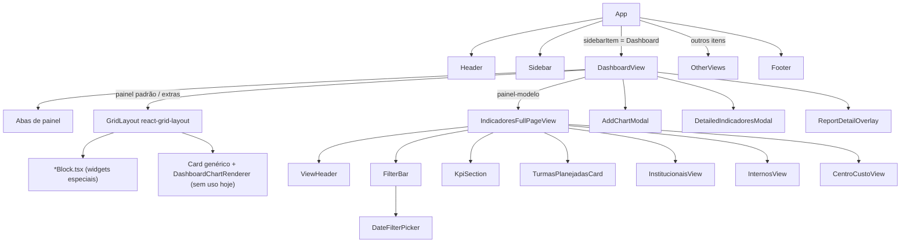

# 01 — Arquitetura

> Estado em 2026-09-10 (commit `0f14348`). Descreve **como o sistema é hoje**; mudanças propostas ficam em `07-backlog-e-debito-tecnico.md` e `docs/features/`.

## 1. Visão geral

- **SPA 100% client-side.** Vite + React 19 + TypeScript. Sem backend, sem chamadas de rede, sem autenticação.
- **Dados simulados** gerados no navegador (estáticos em `src/data/` ou determinísticos via `utils/filterSimulator.ts`).
- **Persistência** apenas em `localStorage` (layout e abas do Dashboard).
- **Deploy** na Vercel como site estático: `vite build` gera `dist/`, e `vercel.json` reescreve toda rota para `/index.html` e aplica cache imutável em `/assets/*` e `/font/*`.

## 2. Árvore de componentes



| Camada | Arquivos | Papel |
|---|---|---|
| Shell | `App.tsx`, `Header.tsx`, `Sidebar.tsx`, `Footer.tsx`, `OtherViews.tsx` | Moldura do LMS Lector Live (banner, menu "Minha área", rodapé) |
| Dashboard | `DashboardView.tsx`, `AddChartModal.tsx` | Abas, grid, catálogo, persistência |
| Widgets | `*Block.tsx`, `VerDetalhesButton.tsx` | Um componente por widget "bloco completo" |
| Telas de indicadores | `IndicadoresFullPageView.tsx`, `ViewHeader`, `FilterBar`, `DateFilterPicker`, `KpiSection`, `TurmasPlanejadasCard`, `*View.tsx` | Réplica da tela Indicadores T&D |
| Relatórios | `ReportDetailOverlay.tsx`, `DetailedIndicadoresModal.tsx`, `utils/exportUtils.ts` | Tabelas detalhadas e exportação |
| Dados | `data/*.ts`, `utils/filterSimulator.ts`, `types.ts` | Mocks, catálogo, simulador |

`BottomBanners.tsx` não é importado por ninguém (código morto).

## 3. Fluxo de dados — três caminhos

**A) Telas de indicadores (reagem a filtros)**

```
DateFilterValue + Record<filtro, valor> + afastados
      │
      ▼
getSimulatedData(view, dateFilter, filters, afastados)      utils/filterSimulator.ts
      │  seed = hash(ano-mês-modo-filtros…) → sempre os mesmos números para os mesmos filtros
      ▼
{ monthlyData, trainingTypesData, agendaData, internalTrainingsData,
  jobPositionsData, costCenterRowsData, kpis }
      │
      ▼
IndicadoresFullPageView → KpiSection, TurmasPlanejadasCard, *View
```

**B) Widgets do Dashboard (estáticos)**

```
data/mockData.ts, turmasExecucaoData.ts, educacaoPermanenteData.ts, trainingCatalogData.ts
      │  import direto
      ├──► *Block.tsx          (não recebem dados por props)
      └──► reportDefinitions.ts (tabela do Ver Detalhes, montada no import do módulo)
```

**C) Card genérico (infraestrutura sem uso)**

```
CatalogChartDef.generateData({ period, category }) → DashboardCardItem.data → DashboardChartRenderer
```

Hoje todo item ativo do catálogo é widget especial, e o resto é `comingSoon`, que não pode ser adicionado. Por isso o card genérico (seletor de categoria, troca de tipo de gráfico Barra/Coluna/Pizza/Linha/Tabela e `DetailedIndicadoresModal`) **não é alcançável pela UI**. Ele existe para os itens do roadmap.

> ⚠️ Consequência de A ≠ B: o mesmo indicador pode mostrar números diferentes no widget do Dashboard e no painel-modelo.

## 4. Estado

Não há Context, Redux nem Zustand: todo estado é `useState` local.

| Onde | Estado | Observação |
|---|---|---|
| `App` | `sidebarItem`, `dashboardFocusRequest {view, token}` | `token = Date.now()` força re-foco mesmo pedindo a mesma view |
| `DashboardView` | `panels[]`, `activePanelId`, `selectedPeriod` (nunca muda), flags de modais, `editingPanelId`, `openTypeDropdown` | `setCards`/`setLayout` escrevem no painel ativo |
| `IndicadoresFullPageView` | `view`, `dateFilter`, 3 mapas de filtros (um por view), `exportMsg` | Estado independente por painel (`key={panel.id}`) |
| Blocks | Aba interna, página, setor ou mês selecionado | Não persiste |

```ts
interface DashboardPanel {          // DashboardView.tsx
  id: string;                        // 'default' | `panel_${timestamp}[_i]`
  name: string;
  cards: DashboardCardItem[];
  layout: LayoutItem[];              // react-grid-layout
  templateId?: ViewType;             // presente = painel-modelo
}
```

## 5. Persistência (localStorage)

| Chave | Conteúdo |
|---|---|
| `lector_dashboard_layout_v1` | Layout (`LayoutItem[]`) do painel `default` (chave antiga mantida por compatibilidade) |
| `lector_dashboard_layout_v1_<panelId>` | Layout de cada outro painel |
| `lector_dashboard_panels_v1` | `[{ id, name, templateId? }]`: ordem e nomes das abas |
| `lector_dashboard_active_panel_v1` | Id da aba ativa |

- Os **cards** do painel `default` são sempre recriados a partir de `DEFAULT_LAYOUT_SPEC`; só o layout é restaurado (`reconcileLayout`).
- Cards adicionados em painéis que não são o `default` **não são persistidos**: somem ao recarregar.
- Todo acesso ao `localStorage` está em `try/catch` (modo privado ou cota cheia), e a falha é silenciosa.
- Mudança de formato ⇒ subir o sufixo `_v1` ou migrar.

## 6. Grid do Dashboard (`utils/gridLayout.ts`)

| Constante | Valor |
|---|---|
| Colunas | 12 |
| Altura da linha / margem | 40px / 20px (altura em px = `h*40 + (h-1)*20`) |
| Mínimo / máximo | 3×5 / 12×20 |
| Card novo | 4×8 (3 por linha, preenchendo a última linha antes de abrir outra) |
| Breakpoint | < 1024px: coluna única, sem arrastar/redimensionar |

Arraste pelo card inteiro, exceto `select`, `button` e `.no-drag`. Redimensionamento por qualquer uma das 8 alças, que são invisíveis (só o cursor muda), conforme `index.css`.

## 7. Impressão e exportação

- **PDF** = `window.print()` com CSS em `index.css` (`@page A4 landscape`, classes `no-print`, `print-only`, `print-block`, `page-break-inside-avoid`). Detalhes em `06-relatorios-exportacao.md`.
- **Excel** = HTML com namespaces do Office salvo como `.xls` (Blob + `<a download>`). **CSV** com `;` e BOM UTF-8.

## 8. Build e assets

- `npm run build`: um único chunk JS de **611 KB** (171 KB gzip), com aviso do Vite. O CSS pesa 272 KB porque inclui `lector-icons-embedded.css` (fonte em base64).
- A fonte de ícones é carregada **duas vezes**: `/lector-icons.css`, pelo `index.html` (arquivos em `public/font/`), e `../lector-icons-embedded.css`, importado em `main.tsx`.
- Fonte Barlow vem do Google Fonts (`index.html`).
- O alias `@/*` aponta para a **raiz do repo** (não para `src/`) e não é usado.
- Imagens: `public/banner-unimed.png` (banner do Header, 1050×190) e o avatar do Header vem do Unsplash (URL externa).

## 9. Decisões registradas

Antes de propor mudar uma destas, leia o motivo. "Provisória" = aceita para o protótipo, a rever quando houver dados reais.

| # | Decisão | Motivo | Status |
|---|---|---|---|
| D1 | Dados simulados e determinísticos no cliente | Protótipo navegável para validação; mesmos filtros ⇒ mesmos números (sem "piscar") | Provisória |
| D2 | Widgets "bloco completo" são cópias fiéis dos blocos das telas | Fidelidade visual à tela de origem e ao painel Qlik de referência | Provisória: gera duplicação (ver débito T-02) |
| D3 | Painel-modelo renderiza a tela inteira (`IndicadoresFullPageView`), não um grid | O cliente quer a tela de Indicadores T&D idêntica, com os filtros próprios | Vigente |
| D4 | Layout e abas só em `localStorage` | Sem backend | Provisória |
| D5 | PDF via `window.print()` + CSS de impressão | Zero dependência e texto selecionável | Vigente |
| D6 | Excel via tabela HTML `.xls` | Zero dependência, com estilo (cores, cabeçalho) | Vigente (o Excel mostra aviso de formato) |
| D7 | Gráficos feitos à mão (divs/SVG + motion), sem biblioteca de charts | Controle total do visual e bundle menor | Vigente |
| D8 | Navegação sem router | Protótipo de uma tela principal | Provisória |
| D9 | `CatalogChartDef.generateData` + card genérico mantidos | Base para os itens "Em breve" do catálogo | Vigente |
